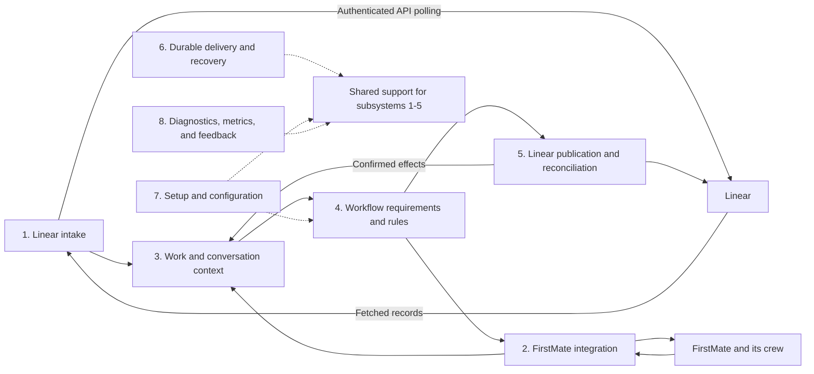

# FM Linear architecture

## Status and scope

This document describes FM Linear's intended subsystem responsibilities, relationships, and ownership.
It does not claim that every capability is implemented.
The [design principles](../AGENTS.md#design-principles) guide these responsibilities.
Technology selections and their rationale are maintained in [TECH_STACK.md](TECH_STACK.md).
Concrete implementation guidance, configuration paths, compatibility findings, and verification expectations are in [IMPLEMENTATION_NOTES.md](IMPLEMENTATION_NOTES.md).

## System ownership

FirstMate is a third-party orchestrator that FM Linear extends through existing interfaces.
Users interact through Linear to request work, observe progress, provide feedback, and approve next steps.
FM Linear translates those interactions into inputs for FirstMate and presents execution facts through the user's configured workflow.

| System | Owns |
| --- | --- |
| FirstMate | Accepted work, execution queue, scheduling, dependencies, delegation, worker supervision, and execution state. |
| Linear | Native issues, comments, reactions, labels, and field changes. |
| FM Linear | Issue/task correspondence, workflow requirements and mappings, synchronization state, and reliable delivery. |

Creating an issue expresses a request; FirstMate determines how to accept and execute it.
A captain's board edit becomes input interpreted under explicit workflow rules.
Moving an issue to Done does not itself establish that its workers finished or that a PR merged.

FM Linear keeps synchronization operational without requiring the agent to remember Linear bookkeeping commands.
It asks agents to supply interpretations or semantic reports when available evidence cannot determine the next action.

## Subsystem relationships

The eight subsystems are logical modules that can run within one local service.
They do not imply eight separately deployed processes or eight databases.
FM Linear targets macOS and Linux.
Keep platform-specific installation, process control, filesystem handling, and local communication behind explicit interfaces so subsystem behavior stays consistent across operating systems.

Solid arrows show the main information flow.
Dashed arrows identify shared support rather than event ordering.
The FirstMate integration owns the external interfaces; FirstMate continues to decide worker assignments and execution.

## 1. Linear intake

Fetch comments, reactions, issue creation, and relevant field changes directly from Linear's authenticated API.

Polling is the sole intake mechanism and requires only outbound API access.
The retrieval cadence is configurable with a default of 30 seconds.
Intake owns reliable capture of source records; it preserves their provenance and enforces configured access boundaries.
Fetched content does not grant permissions beyond the author's configured authority.

Intake establishes what Linear reported.
Workflow rules or an agent determine what the input means and what action follows.

## 2. FirstMate integration

Deliver work requests, feedback, and workflow requirements through existing FirstMate interfaces.
Observe execution facts, progress, explicit task dependencies, open decisions, and delivery outcomes.
Normalize those observations for the rest of FM Linear while preserving their source, freshness, and task identity.

Keep upstream-specific commands, state formats, and compatibility checks in this adapter.
Prefer FirstMate's structured state interfaces over independent interpretations of raw status history.
Keep unknown execution state explicitly unknown.
Own a versioned behavioral contract suite for the installed Firstmate code, exposed through the proposed `fm-linear test` command and reused by setup and change-triggered checks.
Scope results to the actual revision, relevant local changes, configuration, and environment; isolated test probes must not operate on live tasks or services.
Invalidate results when their inputs change and hold only affected integration operations when a required contract fails or cannot be verified.

This module does not take over worker supervision or write synthetic execution states into FirstMate's records.
When a missing execution fact prevents a meaningful integration action, deliver a tracked inspection request through FirstMate after checking existing evidence.
Expose observed notification emission and acknowledgment separately from queued delivery, retaining unknown notification outcomes as unknown.
Import request-attributable usage only when the upstream interface exposes reliable attribution.

## 3. Work and conversation context

Maintain the relationships between Linear issues, FirstMate homes, tasks, execution attempts, comment threads, and artifacts.
Retain explicit dependency identities and their source so task dependencies can be mapped to relationships between connected issues.
Use stable identifiers and distinguish successive attempts even when a task name is reused.
An issue can involve several tasks; an old attempt must not drive the active attempt's state.

Keep issue enrollment separate from the assignee so captain handoffs preserve synchronization.
Record the thread a response belongs to independently of board status.
Several questions and answers may share one review conversation.
Maintain stable request identities, origin and purpose, execution-attempt scope, and batch membership so repeated delivery can be distinguished from new work.

Assemble the issue context a newly assigned crewmate needs, including plans, decisions, current artifacts, and remaining work.
Preserve accessible artifact references and identify their versions.
Artifact access must survive the originating conversation and worktree.
Include configured execution context, such as a Herdr panel name, alongside task and artifact references.
Treat display names as optional presentation data associated with a stable execution identity, not as delivery addresses.

This module owns correspondence and collected context, while FirstMate owns the execution queue.
Agents supply substantive summaries and interpretations; code preserves and publishes their recorded results.

## 4. Workflow requirements and rules

Apply configured policy to recorded facts to determine instructions, expected outputs, approval conditions, next responsible actor, and intended Linear updates.
Keep those decisions separate from transport and database mechanics.

Resolve applicable requirements before task dispatch so the assignment includes the instructions and outputs the worker will need.
Record which configuration and instruction versions applied to each assignment.
Make changes to an active assignment explicit rather than silently changing its requirements.

Before a handoff, check the required evidence.
For example, captain review might require a linked PR, verification results, and an accessible HTML review guide.
Code can check those outputs and their recorded approvals; artifact quality or ambiguous feedback may require agent or captain judgment.

Distinguish worker completion, review readiness, and delivery completion according to the task's delivery contract.
A PR awaiting review, a delivered investigation report, and an authorized local merge have different completion conditions.
Bind approval to the relevant actor, scope, task attempt, and artifact revision.

Workflow rules determine the intended state of each managed Linear field and the meaning of captain overrides.
They return actions for delivery rather than performing external writes themselves.
Keep routine synchronization silent and request clarification only when existing evidence cannot resolve a necessary decision.
Coalesce repeated observations into one outstanding question for the same fact and attempt, allow relevant records time to arrive, and batch nonurgent questions while prioritizing captain input.

## 5. Linear publication and reconciliation

Apply intended comments, status changes, assignments, managed labels, artifact links, and blocks / blocked-by relationships to Linear.
Record confirmed effects for subsequent processing.

Keep replies in their originating thread unless an explicit decision starts a distinct conversation.
Preserve unrelated labels and respect configured handling of captain edits.

Reconcile status, assignee, managed labels, and managed dependency relationships independently.
A matching status must not prevent repair of an incorrect assignee.
Periodic checks repair missed or incomplete effects under the same workflow rules used when new facts arrive.

This module owns how to publish an intended result correctly; workflow rules own which result is intended.

### Task dependencies

Firstmate owns dependencies between work items and decides how they affect scheduling.
The Firstmate adapter reads explicit dependency records from the configured backlog when a compatible interface is available.
Work and conversation context maps each end of the dependency to its connected Linear issue; publication maintains the corresponding blocks / blocked-by relationship.
A dependency can exist at any stage and can coexist with useful work in progress.
The Waiting status describes a current impediment; it does not itself identify a dependency or prove that all work has stopped.

Prefer recorded dependency information over asking the agent to repeat it in comments.
When a necessary relationship cannot be observed, ask Firstmate to inspect or explicitly report it, preserving uncertainty until that information is available.
An instruction to maintain dependency records supports this process but is not evidence that the records are complete.

Preserve unrelated, manually created Linear relationships under the configured edit policy.
An unreadable source or missing issue mapping must not be interpreted as removal of a dependency.
Dependencies within a single mapped issue must not create a self-blocking Linear relationship.
A dependency edited in Linear is input for Firstmate to assess, not an automatic change to its execution queue.
Concrete source interfaces, reporting fallback, and verification cases belong in [the implementation notes](IMPLEMENTATION_NOTES.md#task-dependency-synchronization).

## 6. Durable delivery and recovery

Provide persistent events, pending actions, delivery mappings, acknowledgements, retries, and restart recovery across the integration.
Persist each accepted obligation before acknowledging the corresponding handoff.
Keep captured, delivered, acknowledged, and resolved states distinct.
Record delivery attempts, observed notifications, acknowledgments, and request resolutions with stable identities for diagnostics and metrics.
A pending question must not cause a fresh reminder on every poll; bounded follow-up policy must respect Firstmate's event-handling contract.

Use stable identities to make repeated processing safe.
Preserve pending work across schema upgrades and configuration changes.
Escalate persistent delivery failures without reporting success or discarding the original input.
Keep independent work progressing when a source or destination is slow or unavailable.

## 7. Setup and configuration

Own installation, credential configuration, team and user mappings, workflow profiles, instruction templates, issue-detail presentation, polling cadence, and configuration versions.
Provide supported operations that FirstMate can invoke when the user requests a workflow change.
Persist those changes so they survive the conversation.
Configuration belongs to the user installation and can serve multiple projects and FirstMate homes.
Keep workflow configuration, credentials, and operational state separate.

Validate configuration before activation and preserve a usable configuration when an edit is invalid.
Provide opinionated defaults with explicit, replaceable mappings.
Keep stable identities separate from display names.

For example, map an observed model identifier to a Linear label ID.
Users can rename the label or change the mapping without changing the recorded model identity.
Offer mappings for new models without relabeling historical work or overwriting user choices.

Show proposed changes to managed Linear resources before applying them with user approval.
Users choose separately whether to update the software and whether to adopt new workflow defaults.

## 8. Diagnostics, metrics, and feedback

Expose pending delivery, stale observations, missing outputs, retries, and persistent failures.
Retain enough provenance to explain the path from a source event to an intended action and its result.
Avoid claiming an agent acted merely because it received a message.

Help agents distinguish a product bug, a supported customization, and a missing capability.
Prepare relevant diagnostic evidence for a bug report or feature request and submit it with user approval.
Detect unexpected errors and persistent failures in code, and create durable incidents with focused evidence and a reviewable report draft.
Ask the captain to approve the exact GitHub report before publication, using Firstmate for investigation and interpretation when its verified messaging path is available.
Coalesce repeated failures into the same incident and keep transient errors within normal recovery policy.
Preserve draft, approval, and submission state separately from operational Linear alerts; a Linear alert does not authorize a public GitHub report.
Exclude credentials and unrelated private content.

Own the definitions and local summaries of integration metrics, including questions per active task, observed notification frequency, repeat notifications, batching, questions resolved without contacting Firstmate, report turnaround, and attributable token usage when available.
Other subsystems supply lifecycle facts through a shared instrumentation interface; this module derives the measurements rather than independently inferring task state.
Separate captain-originated requests from integration-generated clarification and distinguish attempted, confirmed, and unknown delivery outcomes.
Pair noise measurements with pending-request age and delivery delays so quiet operation does not conceal stalled work.

Store lightweight metric events and derived summaries in FM Linear's existing SQLite database.
No ninth subsystem, separate metrics database, hosted telemetry service, or additional agent call is required.
Provide a supported local summary and versioned structured export for Console.
Store compatibility-check results and expose new failures without repeatedly notifying Firstmate about an unchanged condition.
Model background compatibility failures as durable incidents with separate notification delivery state.
Use the configured Linear destination and captain identity for blocking-failure alerts, verified Firstmate messaging when available, and local diagnostics when remote channels fail.
Keep incident reporting independent of a failed Firstmate capability and exclude diagnostic issues from normal work enrollment.
The Firstmate adapter checks compatibility before dependent synchronization on every service start and when the installed integration code changes.
Rechecking pauses affected operations without requiring a full service restart.
Console owns its cross-tool reporting and dashboard, while FM Linear owns the semantics of these integration measurements.

This module reports integration health and supports investigation.
FirstMate retains responsibility for worker recovery and execution judgments.

## Workflow requirements at dispatch

A review guide illustrates how requirements should accompany execution.

1. Setup and configuration supplies the user's review-guide instructions.
2. Workflow requirements and rules resolves those instructions and expected outputs for the task.
3. FirstMate integration provides the requirements for FirstMate's initial crewmate assignment.
4. The crewmate completes the work, creates the guide, and reports its artifacts.
5. FM Linear records the artifacts and checks the required handoff evidence.
6. Linear publication links the guide and applies the configured captain handoff.

The supported mechanism for including requirements before dispatch remains unverified; see [the implementation notes](IMPLEMENTATION_NOTES.md#firstmate-compatibility-and-dispatch).
Missing-output detection is recovery for an incomplete assignment, not the normal time to introduce the requirement.
FirstMate chooses a replacement worker if the original crewmate is unavailable.

## Persistence and the wider tool suite

FM Linear owns one operational SQLite database for its integration state.
Subsystems share that database through owned interfaces rather than introducing separate databases for each module.
The database also holds integration metric history and summaries, with explicit retention and observation coverage.
Metrics retention must not delete pending obligations or delivery identities required for safe retries.

Each independently useful tool owns its operational data and migrations.
FirstMate retains its existing storage.
Validatus would own review runs, findings, reviewed revisions, and validation outcomes.
Console would own collected reporting history, cross-tool relationships, metric definitions, aggregates, and dashboard preferences.

Console should consume supported snapshots and incremental changes where available, then query its own reporting database.
A local CLI returning structured data can provide that interface; a separate network server is not inherently required.
Console should not depend on FM Linear's private table layout or write its operational records.

Use stable source identities, timestamps, and relationships to avoid counting the same outcome more than once.
Console owns reporting definitions such as what counts as a completed work item or a unit of throughput.
Retain reporting history deliberately because current snapshots cannot reconstruct events a source has already removed.

A shared database service is not required for this design.
SQLite remains an implementation choice within each tool, rather than the interface connecting the suite.
