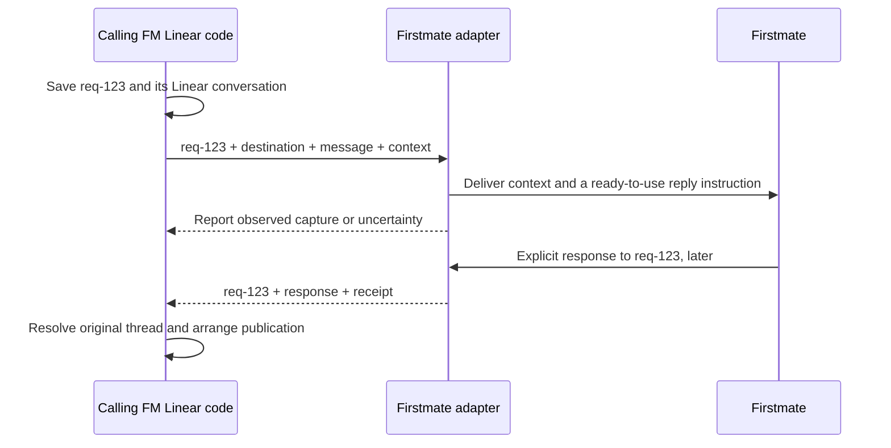
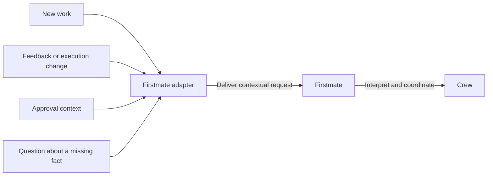
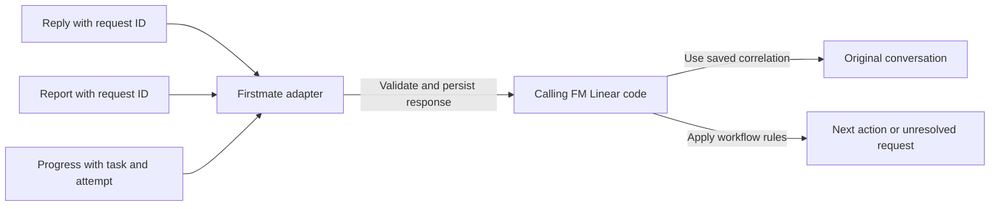
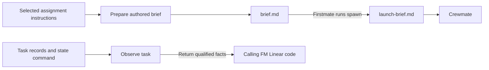

# A verified Firstmate adapter

Connect FM Linear to Firstmate with testable interfaces and explicit limits.

<QuickSummary>
<Why>

- Trust the Firstmate connection before building Linear synchronization.

</Why>
<What>

- Build and verify the Firstmate adapter as the first subsystem.

</What>
<How>

- Check compatibility and observe tasks.
- Prepare briefs and exchange contextual messages with correlated responses.
- Prove recovery automatically and provide four manual checks.

</How>
</QuickSummary>

<TableOfContents>
<Entry section="Status quo" gist="Architecture is documented; runtime adapter implementation remains outstanding." />
<Entry section="Desired experience" gist="Inspect the connection and verify its behavior yourself." />
<Entry section="The adapter owns the Firstmate boundary" gist="Keep orchestration and Linear workflow decisions with their owners." />
<Entry section="Seven interfaces form the subsystem contract" gist="Use scoped identities and explicit evidence at every boundary." />
<Entry section="The caller keeps Linear context; the adapter carries the request" gist="Give Firstmate context and use the request ID for replies." />
<Entry section="Different requests use the same delivery path" gist="The caller chooses the message; Firstmate interprets it." />
<Entry section="Replies return by request ID; progress returns by task" gist="Code restores routing context without asking the agent to repeat it." />
<Entry section="Briefs and state reads use separate interfaces" gist="File preparation and observations do not require conversational replies." />
<Entry section="Check that the installed Firstmate still works with FM Linear" gist="Changed or unverified code cannot inherit a passing result." />
<Entry section="Preparation and delivery report only what they establish" gist="Preserve uncertainty and detect missed instructions where evidence permits." />
<Entry section="Build the adapter in three increments" gist="Finish this subsystem before starting another." />
<Entry section="Automated checks follow the testing ladder" gist="Use real persistence and upstream scripts where behavior depends on them." />
<Entry section="Four manual checks demonstrate the connection" gist="Supply copyable commands, expected results, and isolated fixtures." />
<Entry section="Acceptance criteria" gist="Review evidence and approve the subsystem before further implementation." />
</TableOfContents>

<Part title="Context" />

<Slide type="status-quo" />
## The architecture exists; the adapter does not

- The repository has a working docs site, engineering practices, and eight defined subsystems, but no runtime adapter on this branch.
- Earlier compatibility research used Firstmate revision `b84e0e3`.
- The local source checkout is clean at `6ee3326`; its extension contract still excludes instruction injection and launch hooks.
- Its current interfaces include authored briefs, `fm-crew-state.sh`, and `fm-procevent.sh` with `process-event-adapter/1`.
- Source inspection informs this plan; behavioral compatibility is still to prove against the installation selected for the adapter.

<Slide type="desired-experience" />
## You can check the connection before trusting it

- Inspect which Firstmate home and code the adapter uses and which capabilities passed verification.
- See task observations with their source and age, without mistaking a stopped worker for completed delivery.
- Exercise prepared instructions and message capture without connecting Linear.
- Run four short manual checks after the automated suite passes, then review the subsystem before further development.

<Part title="Scope and interfaces" />

## The adapter owns the Firstmate boundary

- **Own:** Firstmate-specific translation and transport: installation discovery, compatibility checks, task observations, brief preparation, message delivery, and response validation.
- **Receives:** destinations, instructions selected for an assignment, messages with enough context to understand them, and opaque request IDs supplied by calling code.
- **Returns:** observations, preparation receipts, capability results, delivery evidence, and asynchronous responses linked to their requests.
- **Delegate:** Firstmate chooses workers, schedules work, interprets feedback, and decides how to steer the crew.
- **Leaves to callers:** Linear IDs and thread mapping, context selection, workflow decisions, approval policy, retry scheduling, and follow-ups.
- **Exclude:** Linear API integration, a setup wizard, service installation, and a complete incident-reporting system.
- **Supporting code:** add only the SQLite records, typed errors, logging, and command entry points needed to prove this adapter.

## Seven interfaces form the subsystem contract

Proposed TypeScript operations form the contract; command spelling is finalized with their schemas before implementation.
Every destination identifies a Firstmate home.
Operations on existing work also identify the task and, when relevant and available, its execution attempt.
A request for new work may target the home before Firstmate creates a task.
An opaque request ID correlates results; it cannot replace the destination and message content.

| Interface | Principal input | Successful result |
| --- | --- | --- |
| `getFirstmateInstallation` | Explicit location or discovery options | `FirstmateInstallation`; ambiguity requires an explicit selection. |
| `testFirstmateInstallation` | Installation and selected integration capabilities | `FirstmateInstallationCheck`; tests FM Linear compatibility, not overall Firstmate health. |
| `getFirstmateTask` | `FirstmateTaskRef` | `FirstmateTaskSnapshot`; missing evidence remains unknown. |
| `updateFirstmateBrief` | `FirstmateBriefUpdateRequest` | `FirstmateBriefUpdateReceipt`; confirms an existing brief was updated, not that a worker received it. |
| `checkFirstmateBrief` | Update receipt and target `FirstmateTaskAttemptRef` | `FirstmateBriefCheck`, based on available launch evidence. |
| `sendFirstmateMessage` | `MessageToFirstmate` | `MessageToFirstmateReceipt`; a substantive reply arrives separately. |
| `receiveFirstmateMessage` | Incoming submission to validate | `MessageFromFirstmate`; handles submissions, not polling or synchronous waiting. |

**Objects passed through the adapter.**
These are interface types, not a requirement for a class or database table per object.
References identify something; snapshots describe observed facts about it.

| Area | Type | Meaning and principal contents |
| --- | --- | --- |
| Installation | `FirstmateInstallation` | Resolved home, code location, configuration, prerequisites, and a fingerprint of the relevant inputs inspected. |
| Installation | `FirstmateInstallationCheck` | Capability-specific passed, failed, or not-verified results with evidence and the installation fingerprint tested. |
| Tasks | `FirstmateTaskRef` | A task identity scoped to its Firstmate home. |
| Tasks | `FirstmateTaskAttemptRef` | A task reference and the identity of one execution attempt; earlier attempts cannot establish the current attempt's outcome. |
| Tasks | `FirstmateTaskSnapshot` | Task reference, available activity and attempt evidence, explicit dependencies when available, and observation sources and times. Unknown facts remain explicit. |
| Briefs | `FirstmateBriefUpdateRequest` | Target task, expected revision of an existing Firstmate-authored brief, and resolved instruction text with its version. This describes a requested modification, not the brief itself. |
| Briefs | `FirstmateBriefUpdateReceipt` | Target task, resulting brief revision, and instruction version. Update only FM Linear's managed section without duplicates, reject missing or stale briefs, and preserve existing captain and Firstmate content. |
| Briefs | `FirstmateBriefCheck` | Whether the expected instructions appeared in the brief used for the identified launch attempt: included, missing, or not verified, with supporting evidence. Caller policy decides whether corrective delivery is needed. |
| Messages | `MessageToFirstmate` | Opaque request ID, home or task destination, message text, relevant context, and any expected response contract. |
| Messages | `MessageToFirstmateReceipt` | Request correlation, delivery-attempt identity, and qualified delivery evidence. It never establishes that the request was answered or resolved. |
| Messages | `MessageFromFirstmate` | A reply linked to its original request ID, or an unsolicited report linked to a task and attempt; includes message identity, content, verified origin, and receipt time. |

**Message identity and correlation.**
Model `MessageFromFirstmate` as distinct reply and report variants, rather than one object whose correlation fields are all optional.
A reply requires its original `RequestId`; an unsolicited report requires a `FirstmateTaskAttemptRef`.
Each incoming message has its own `MessageId`, because one request may receive several distinct replies.
Repeated delivery of the same message retains its identity for deduplication.
A request ID establishes correlation, not sender authenticity.
Message content can be text or a specifically defined structured report; define and validate each supported report contract rather than accepting an unrestricted object.
The caller retains Linear issue and thread mappings and decides what an accepted message means.

**Contract details to finalize before implementation.**
Use distinct ID types for homes, tasks, attempts, requests, and messages so unrelated identifiers cannot be substituted accidentally.
Validate external submissions at runtime and represent invalid or missing correlation explicitly.
Define operation-specific failures, including ambiguous installations, missing tasks, stale briefs, and invalid submissions; the table above describes successful results only.
Configure installation access, subprocess execution, and persistence when constructing the adapter so callers do not reconstruct those dependencies for each operation.
Scope each adapter instance to its configured installation and reject references to another home.

**Objects owned by later subsystems.**
Record their meanings now; refine their fields when reviewing their owning subsystem rather than expanding this milestone into a complete system schema.

| Owner | Proposed objects |
| --- | --- |
| Linear intake | `LinearChange`, `LinearIssueRef`, and `LinearCommentRef`: retrieved changes and their origins. |
| Work and conversation context | `ConnectedWork`, `ConversationLink`, `ArtifactRef`, and `WorkDependency`: associations between work, issues, threads, artifacts, and explicit dependencies. |
| Workflow requirements and rules | `WorkflowDefinition`, `WorkflowStage`, `ResolvedInstructions`, `ApprovalDecision`, and `ReportRequest`: the user's process, instructions, authorized decisions, and questions about missing facts. |
| Linear publication and reconciliation | `LinearIssueUpdate`, `LinearCommentPublication`, and `LinearDependencyUpdate`: specific intended changes to Linear. |
| Durable delivery and recovery | `DeliveryOperation` and `DeliveryAttempt`: an obligation and each separate attempt to carry it out. |
| Setup and configuration | `InstallationConfig`, `LinearConnection`, `FirstmateConnection`, and `CommunicationPreferences`: configured connections and user preferences. |
| Diagnostics, metrics, and reporting | `OperationalIncident`, `MetricObservation`, and `BugReportDraft`: problems, measurements, and reports awaiting publication approval. |

## The caller keeps Linear context; the adapter carries the request

**The boundary.** Calling FM Linear code saves the request-to-issue/thread relationship and selects the relevant conversation and artifact references.
The adapter receives a destination and that context; it does not query Linear or choose a thread.

<MermaidDiagram>

Capture and response are separate events; Firstmate may respond later or never respond.

</MermaidDiagram>

**What Firstmate sees.** Task: Add team invitations.
Previous proposal: single-use invitations expire after seven days.
Captain: Can we also revoke invitations?
Reply using the proposed `fm-linear respond req-123` command with your answer.

The ID routes the answer; the accompanying content explains the question.
A proposed `fm-linear request show req-123` command retrieves more saved context through the caller-owned request store when needed.
Neither command exists yet; the agent supplies substantive content, while code supplies routing metadata.

## Different requests use the same delivery path

The caller decides why to send a message; the adapter delivers it without interpreting workflow meaning.

<MermaidDiagram>

Firstmate retains scheduling and worker supervision; message categories do not become adapter-owned workflow rules.

</MermaidDiagram>

| Request | Example content supplied by the caller | Context Firstmate needs |
| --- | --- | --- |
| New work | Add team invitations and return a plan. | Goal, repository, constraints; an existing task is optional. |
| Feedback | Add a way to revoke invitations. | Task, relevant proposal or artifact, and the captain's comment. |
| Approval | Maya approved plan v2 for implementation only. | Reviewed version and the authority/scope established by the caller; the adapter does not grant approval. |
| Pause or cancellation | Stop this task and confirm what remains running. | Task, attempt, and the exact requested execution change. |
| Changed or missed instruction | Include an interactive recap in the current assignment. | Task, applicable instruction, and whether it changed or was missing at launch. |
| Missing-fact question | What did this stopped worker produce? | Task, attempt, known evidence, and the specific missing information. |

The adapter does not ask Firstmate to select a Linear status, find a thread ID, or decide whether another reminder is due.

## Replies return by request ID; progress returns by task

Firstmate supplies content through an explicit submission command; the adapter restores saved routing context from the request ID.
A response can be a conversational reply, a structured outcome report, or an unsolicited task update.

<MermaidDiagram>

An unsolicited update must not be guessed into the most recent open request or thread.

</MermaidDiagram>

- **Reply:** Firstmate returns an answer to `req-123`; code looks up its home, task, issue, and thread without making the agent repeat them.
- **Report:** Firstmate supplies the requested outcome, uncertainty, and artifact references; the caller decides whether the evidence answers its question.
- **Progress:** without a request ID, Firstmate must identify the work; conversation context determines where to publish the update.
- **Missing or invalid response:** preserve the unanswered request; reject unknown IDs, prevent cross-home correlation, and return stale-attempt reports as historical evidence.
- **Retries:** repeated submission of one response returns its receipt without duplicating publication; distinct follow-up replies must remain distinguishable.

Firstmate's extension invocation ID and captured-event sequence are transport identifiers, not FM Linear request IDs.
The adapter records their correspondence where verified; event capture or a handled marker never substitutes for an explicit substantive response.
The caller owns bounded follow-ups, response deadlines, and deciding when a request is resolved.

## Briefs and state reads use separate interfaces

Messages support conversations; these two interfaces supply initial instructions and observe execution evidence.

<MermaidDiagram>

These paths return receipts or observations in code; they do not wait for a conversational answer from Firstmate.

</MermaidDiagram>

- **Before work:** the caller supplies the recap instruction; preparation edits `brief.md` and preserves the captain's request.
- **After launch:** available evidence may show whether the instruction reached that attempt; the caller decides whether to send a corrective request.
- **During work:** `getFirstmateTask` reads supported records and `fm-crew-state.sh`, preserving source, time, and uncertainty without asking an agent on every poll.
- **Limit:** a receipt does not prove that the agent followed instructions, and a stopped worker does not prove delivery.

## Check that the installed Firstmate still works with FM Linear

Firstmate installations can change as their checkouts follow `main`.
The purpose of `fm-linear test` is to catch changes that break FM Linear's assumptions before users encounter failed messages, missing instructions, or incorrect task updates during real work.
A previously passing commit does not establish that the code currently installed still behaves the same way.

The command uses `testFirstmateInstallation` to exercise the installed Firstmate interfaces and returns a `FirstmateInstallationCheck` with readable output and a `--json` option.
It checks behavior and data formats, not merely whether scripts exist or a commit appears on a known-version list.

**What it checks.**
The versioned suite covers the contracts required by each enabled adapter capability.
Representative checks include:

| Integration behavior | What the check exercises | Unexpected failure it helps prevent |
| --- | --- | --- |
| Read task state | Run `fm-crew-state.sh` against controlled task data and verify the output and missing-evidence behavior the adapter relies on. | Misreading a changed output format as current activity or completed work. |
| Update and launch a brief | Exercise the installed brief and spawn scripts with temporary task data and a fake worker harness; confirm the expected authored instructions reach the generated launch brief. | Losing workflow instructions because Firstmate changed how it prepares a launch. |
| Deliver a message | Exercise the selected `fm-procevent.sh` extension binding, event format, routing, and capture/retry behavior with test doubles. | Dropped, duplicated, or misrouted requests after an upstream interface change. |
| Receive reports and read dependencies | Exercise each selected reporting and dependency contract once it is defined and supported. | Treating an unavailable interface, malformed report, or absent dependency evidence as verified support. |

Read-only probes inspect the installed configuration and prerequisites.
Behavioral probes use an isolated copy of the relevant installed code, temporary homes, and bounded execution with test doubles for agents and external services.
They must not launch paid agents, notify the live crew, modify real projects, or write to Linear.
The suite must verify isolation rather than assume that fake harnesses alone prevent live access.

**When checks run.**

- **On demand:** users run `fm-linear test` after updating Firstmate or while investigating unexpected behavior.
- **At service startup:** setup's Save and start path and every service restart run the applicable checks before enabling dependent synchronization; diagnostics start first.
- **After an installed change:** detect changes to the checkout, relevant local files, or configuration, hold affected operations, wait for the installation to settle, and recheck before resuming pending work.
  Changes to FM Linear's adapter or suite also invalidate earlier results.
  Rechecking does not require restarting the entire service.

Persist results in SQLite with fingerprints for the installed code, relevant local modifications, configuration, platform, adapter, and suite.
Recheck those inputs before relying on a result; a change during testing invalidates that result.
FM Linear does not fetch or update Firstmate merely because remote `main` changes.

**How installed changes are detected.**
At startup, record the checked-out Firstmate commit and content fingerprints for the relevant scripts, supporting files, and integration configuration, including local modifications.
Include the FM Linear adapter and compatibility-suite versions in the verification identity.
Normal task data, logs, and other operational writes are excluded from installation-change detection.

The service-lifecycle subsystem compares the installed inputs with the verified fingerprint every 30 seconds using a local check, independently of Linear polling.
This requires no agent invocation or network request, and it does not rerun the behavioral suite when the verified inputs are unchanged.
A filesystem watcher may accelerate detection later; periodic checking remains sufficient for the initial design.
The adapter also compares the relevant fingerprint immediately before a Firstmate operation and holds that operation if its verification is stale.
This reduces the window for using changed code; it does not make an independently modified checkout atomic with command execution.

On detecting a change, hold affected operations and preserve their pending work.
Wait until repeated observations show that the relevant installation inputs have stopped changing, then create a consistent isolated snapshot and run the applicable checks.
Before accepting the results or resuming work, confirm that the installed inputs still match the tested snapshot.
If they changed again, discard the stale result and repeat after the installation settles.
A passed check restores the affected capability; failed or unverified results keep it held and produce the documented diagnostic.

The adapter owns fingerprint computation, pre-operation verification, and the compatibility checks.
The service-lifecycle subsystem owns the periodic schedule, settling policy, and recheck coordination, so automatic monitoring remains outside this first adapter milestone.

**What users see when something breaks.**
Each capability is passed, failed, or not verified; missing prerequisites or unsupported paths must never appear as a pass.
Required failed or unverified capabilities hold the affected integration operations while independent supported operations continue and pending work remains saved.
Explain the failed contract, installed versions, affected behavior, and suggested next steps.
The future service routes new blocking failures through the configured incident notifications, including an Urgent Linear issue and Firstmate notification only when that messaging path remains verified, with local diagnostics available independently.
Unchanged failures should not produce repeated alerts; successful rechecks allow recovery.

**Scope and limits.**
This milestone implements the command, isolated contract suite, stored results, and capability gate.
The setup wizard, automatic change monitoring, and incident notification delivery remain responsibilities of later subsystems; this adapter exposes the results and gate they will use.
A pass establishes the tested behavior for the recorded installation, not every future agent action or live external connection.
For example, it can prove that supplied instructions reach a launch brief, but cannot force Firstmate to call FM Linear before every dispatch or make a crewmate obey those instructions.
See the [compatibility documentation](http://127.0.0.1:4321/reference/compatibility/) for the user-facing checking, recovery, and notification behavior.

## Preparation and delivery report only what they establish

- **Briefs:** update authored `brief.md` before Firstmate calls `fm-spawn.sh`; never edit generated `launch-brief.md` or intercept dispatch.
- **Missed preparation:** compare evidence for the actual launch attempt and return missing or unknown instruction coverage; caller policy decides on corrective delivery.
- **Limit:** Firstmate must choose to call preparation; neither universal detection nor agent compliance is guaranteed, and late instructions cannot undo earlier work.
- **Messages:** implement the enabled package and process-event protocol; map transport identities to opaque request IDs without importing Linear routing rules.
- **Recovery:** expose verifiable capture evidence to the durable-delivery caller before retrying uncertain effects; unsupported confirmation remains unknown.
- **Responses:** validate structure and correlation, then return responses to the caller; do not resolve the request or infer approval inside the adapter.

<Part title="Build and review" />

## Build the adapter in three increments

Each increment delivers a usable part of the Firstmate adapter, with automated tests and a concrete demonstration.
These are build-and-test increments within one subsystem.
After all three, you review the completed adapter before another subsystem begins.

### 1. Inspect Firstmate and verify compatibility

**What you can do:** select a Firstmate installation, run `fm-linear test`, and retrieve a task's current state with its source and observation time.

**Interfaces delivered:** `getFirstmateInstallation`, `testFirstmateInstallation`, and `getFirstmateTask`.

**What you can verify:** a supported installation passes its applicable checks; a deliberately broken disposable checkout fails the relevant check; missing task evidence is reported as unknown.
The command identifies the code tested and clearly distinguishes supported, failed, and not-verified capabilities.
Add the brief and messaging probes to the same suite as those interfaces are delivered in the following increments.

### 2. Update briefs and check what reached the launch

**What you can do:** add supplied workflow instructions to an existing Firstmate-authored brief, then check whether those instructions appeared in the brief used to launch the crewmate.

**Interfaces delivered:** `updateFirstmateBrief` and `checkFirstmateBrief`.

**What you can verify:** an interactive-recap instruction is inserted without altering the original assignment or creating duplicates when the update is repeated.
A launch that omitted the instruction produces a missing result when evidence establishes the omission, or a not-verified result when launch evidence is unavailable.
The update receipt alone does not establish worker receipt or compliance.

### 3. Exchange messages with Firstmate

**What you can do:** submit a contextual message through Firstmate's supported event mechanism and receive a correlated reply or an unsolicited task report through FM Linear's submission mechanism.

**Interfaces delivered:** `sendFirstmateMessage` and `receiveFirstmateMessage`.

**What you can verify:** a reply returns to the correct request, replaying a captured message or response does not create a duplicate capture, and pending delivery survives a restart.
Distinct follow-up replies retain their own identities; unknown request IDs and stale-attempt evidence cannot be applied to current work.
Delivery capture alone leaves the request unanswered until a substantive response arrives.

### Review the completed adapter

Small persistence and command surfaces support these demonstrations and the adapter's compatibility results, receipts, and response capture.
Fixtures stand in for the request store, Linear correlation, workflow rules, and delivery scheduler; those subsystems are not built inside the adapter.
The isolated demonstrations exercise transport and data handling without requiring a live agent conversation or Linear connection.
At handoff, provide the four runnable manual checks, supported interfaces, remaining limitations, and exact automated results.
No additional subsystem starts before your approval of this one.

## Automated checks follow the testing ladder

Place each assertion at the lowest level that exercises the dependency responsible for the failure.

| Level | Behaviors protected |
| --- | --- |
| Unit and schema | Identity validation, unknown-state preservation, parsing, preparation comparisons, response validation, and capability decisions. |
| Component integration | Actual upstream brief/state/event paths in isolated fixtures; real SQLite receipts, migrations, and transactions. |
| Process smoke | Executable configuration, human and JSON output, exit codes, output limits, and failure diagnostics. |
| Service journeys | Terminate and restart the adapter around durable acceptance and capture; retain work without duplicate capture or cross-routing, and return replayed response receipts. |
| Controlled live | An explicitly approved disposable Firstmate task can demonstrate that a real crewmate receives prepared text; separate from compatibility probes. |

Each test group names the regression it protects and why its level is necessary in the validation handoff.
Use privacy canaries in diagnostics and probes that verify fixture isolation rather than assuming fake commands prevent live access.
Run platform-sensitive contracts on macOS and Linux; unavailable isolation or platform coverage is reported as unverified.
Verify contextual messages without Linear IDs, capture without an answer, unknown request IDs, stale attempts, duplicate submissions, and distinct follow-up replies.
No browser tests are needed for this CLI subsystem.

## Four manual checks demonstrate the connection

Ship a short guide with exact commands, a fixture-creation helper, expected output, and cleanup limited to the fixtures it creates.
These checks demonstrate behavior; automated tests cover the detailed failure cases.

| Check | What you do | What you should see |
| --- | --- | --- |
| Compatibility and change | Run the check, change a supported interface in the disposable checkout, then restore it. | Passing evidence becomes failed or unverified for the affected capability, and recovery requires a new matching pass. |
| Task identity and uncertainty | Inspect the same task name in two fixture homes, then remove one observation source. | Separate results with provenance; missing evidence becomes unknown, not completed work. |
| Brief preparation and fallback | Prepare a sample recap instruction, inspect the upstream-generated launch text, then run an unprepared fixture launch. | Captain content preserved, instruction present after preparation, and missing-instruction evidence for the unprepared attempt. |
| Message and response recovery | Read a contextual sample request, reply using only its ID and answer, then restart and retry; also submit an unknown ID. | The caller fixture finds the original thread, retries retain one response receipt, and the unknown ID is rejected. Capture alone leaves the request unanswered. |

The isolated checks do not prove how an LLM will respond.
Offer one optional real-crewmate demonstration after the isolated checks, with the task and expected instruction visible before dispatch.

<Slide type="acceptance-criteria" />
## Accept the adapter after its evidence is reviewable

- All seven interfaces have documented inputs, operation-specific outputs, and meaningful automated coverage.
- Linear routing and workflow decisions remain outside the adapter; task observations preserve unknown evidence and cannot cross-route homes or attempts.
- Prepared text reaches the tested upstream launch path; skipped preparation returns qualified evidence for the caller's fallback policy.
- Messages carry sufficient context; asynchronous responses retain request correlation across restart without duplicate capture or blind retries.
- Compatibility gates reject stale, failed, or unverified required evidence and report unsupported paths accurately.
- Tests pass on the supported macOS and Linux configurations, with commands, versions, fixture limits, and diagnostic privacy results recorded.
- You receive the four runnable manual checks and a concise interface summary; further subsystem work waits for your approval.
