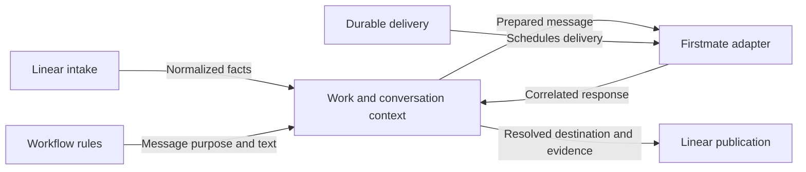
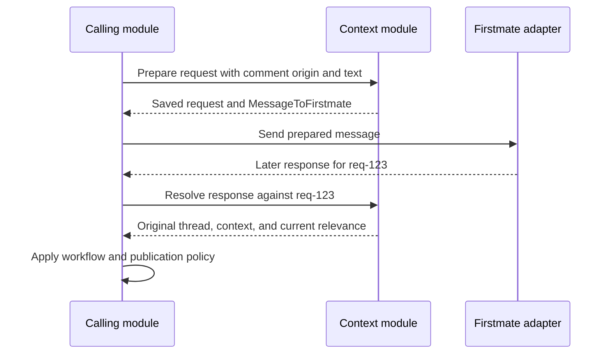

# Connected work and conversations

Keep each work item, request, and reply connected to the correct Firstmate task and Linear conversation.

<QuickSummary>
<Why>

- Keep work and conversations connected as tasks, issues, and crew assignments change.

</Why>
<What>

- Build the work and conversation context subsystem.

</What>
<How>

- Link work, tasks, issues, and artifacts.
- Preserve request origins and resolve reply destinations.
- Verify persistence and routing with four manual checks.

</How>
</QuickSummary>

<TableOfContents>
<Entry section="Status quo" gist="The adapter transports context but does not own its meaning." />
<Entry section="Desired outcome" gist="Callers retrieve connected context instead of reconstructing relationships." />
<Entry section="Own correspondence, not workflow decisions" gist="Keep routing separate from approvals, delivery, and publication." />
<Entry section="Connect work without guessing its identity" gist="Use stable IDs and explicit links, including before a task exists." />
<Entry section="Remember where each request began" gist="Freeze origin and context when preparing a request." />
<Entry section="Return replies to their original conversation" gist="Resolve by request ID; hold missing or ambiguous destinations." />
<Entry section="Keep execution evidence separate from conclusions" gist="Retain attempt scope, artifacts, and explicit dependency evidence." />
<Entry section="Give callers meaningful objects" gist="Expose domain operations with validated inputs and explicit outcomes." />
<Entry section="Assemble enough context to understand the work" gist="Preserve essential facts and bound optional supporting material." />
<Entry section="Store context beside existing adapter records" gist="Use one database with module-owned tables and shared migrations." />
<Entry section="Deliver three reviewable increments" gist="Finish identity, conversations, then composition and manual review." />
<Entry section="Test the failures that could misroute work" gist="Use pure routing tests and real SQLite where persistence matters." />
<Entry section="Try four manual checks" gist="Review routing, ambiguity, stale attempts, and restart recovery." />
<Entry section="Acceptance criteria" gist="Prove correspondence without implementing the remaining subsystems." />
</TableOfContents>

<Part title="Context" />

<Slide type="status-quo" />
## The adapter carries messages; callers still supply their context

- The first-pass Firstmate adapter has seven interfaces for installation checks, tasks, briefs, and messages.
- `MessageToFirstmate` carries a request ID, destination, text, and context; the adapter stores delivery receipts and correlated responses.
- The adapter deliberately does not know Linear issue IDs or comment threads.
- No implemented module preserves those relationships or assembles the context for a new request.
- Task discovery and structured dependency reporting remain unimplemented; this subsystem will consume explicit records from callers and fixtures.

<Slide type="desired-outcome" />
## A reply stays connected when the crew changes

- A caller can ask for the context of `BIG-299` without finding its task, plan, and conversation independently.
- A response to `req-123` resolves to the original Linear thread even when the issue changes status or assignee.
- A replacement crewmate can receive the objective, relevant decisions, and artifact references already recorded for that work.
- Missing links and old execution evidence remain visible instead of silently choosing a destination.
- This milestone proves those behaviors through local fixtures; live Linear synchronization comes later.

<Part title="Proposal" />

## Own correspondence, not workflow decisions

**The problem.** Passing a request ID is useful only if some code remembers what it identifies.
This module owns that correspondence inside the existing workflow integration bounded context.

- **Context:** own work links, conversation origins, request context snapshots, and references to evidence.
- **Workflow rules:** choose instructions, determine authorized actions, and interpret substantive reports.
- **Firstmate adapter:** deliver prepared messages and return responses and observations.
- **Durable delivery:** own retries, unanswered-request follow-up, and delivery obligations.
- **Linear publication:** create issues, publish replies, and synchronize dependency relationships.
- **Setup:** install the standing preference to refer to work by Linear issue identifier; context supplies the verified identifier and URL.

<MermaidDiagram>

The arrows describe module contracts, not an implemented background service.

</MermaidDiagram>

## Connect work without guessing its identity

**The problem.** A task name, issue title, or assignee can change or be reused.
Use stable, scoped identities to retain the same work across those changes.

- `ConnectedWorkId` identifies a local work record with an objective and explicit enrollment state, even before its Linear issue or Firstmate task exists.
- `LinearIssueRef` contains a connection ID, workspace ID, and immutable issue ID; the identifier and URL are display information.
- `FirstmateTaskRef` retains the existing home ID and task ID; an execution attempt adds the existing attempt ID.
- One connected work record may link several tasks and issues.
  An issue or task may participate in more than one record; ambiguous lookups require the caller to select a work record.
- Each task-to-issue association declares whether it is a tracking destination or a related issue; never select the first match as an implicit destination.
- Linking cannot silently merge records or retarget an existing request; conflicting updates return a conflict for the caller to resolve.
- Enrollment is explicit and independent of assignee, status, or whether the captain owes a review.

## Remember where each request began

**The problem.** An issue can change between sending a question and receiving its answer.
Retain the context sent with the request, not only a pointer to whatever the issue contains later.

- `ConversationRef` identifies the connection, issue, and root comment; each comment also retains its own immutable ID and author reference.
- `ContextRequest` records `requestId`, connected work, purpose, destination, optional attempt scope, origin, and the exact context snapshot sent.
- The caller supplies a stable idempotency key derived from its accepted action.
  The module returns the same request on retry and rejects a different payload under that key.
- Origin may be a Linear comment, a Firstmate observation, or a system action; system actions need an explicit reply destination if a public reply is expected.
- Several feedback points can share one request and thread; this model does not force one tracked decision per sentence.
- Explicit batch membership retains each constituent origin; replies must identify a constituent request or return for caller review rather than broadcasting one answer to every thread.

## Return replies to their original conversation

**The problem.** A response contains an opaque request ID, not the Linear metadata required to publish it.
Resolve that metadata in code without asking Firstmate to repeat it.

<MermaidDiagram>

Context preparation does not send the message or mark its request fulfilled.

</MermaidDiagram>

- A known reply resolves to its saved origin; later status and assignee changes do not replace the thread.
- A task report without a request ID uses explicit task associations; zero or several eligible destinations return `unresolved` with the reason and candidate references.
- A deleted or unavailable thread remains the recorded destination; publication reports the problem instead of silently opening another thread.
- A response from an older attempt keeps its original context and is marked historical; it cannot automatically stand in for the current attempt's outcome.
- Distinct message IDs preserve follow-up responses; replaying one ID with different content is a conflict.

## Keep execution evidence separate from conclusions

**The problem.** A worker stopping does not establish that a plan was approved or that delivery is complete.
Store facts and their provenance without inventing workflow conclusions.

- Record task observations with their source and observed time; attempt identifiers are opaque, so do not sort them to infer recency.
- Advancing the current attempt requires an explicit observation and the expected context revision; a stale writer must reread before updating it.
- `ArtifactRef` records its URL or path, title, optional version, originating task attempt, and source; availability checks and uploads belong elsewhere.
- Preserve prior artifact versions; selecting an artifact as current must be explicit rather than inferred from its filename.
- `DependencyEvidence` records directed work or task relationships, source, and whether the report is complete; unknown information never deletes existing relationships.
- Only a newer, explicitly complete report from the same authority may replace that authority's dependency set; partial reports add evidence without implying removals.
- Reports arrive as validated records from callers or fixtures; this milestone does not invent a Firstmate dependency-reporting command or extract relationships from prose.
- Historical evidence remains queryable by attempt ID even after a newer attempt becomes current.

## Give callers meaningful objects

**The problem.** A collection of generic setters would force each caller to rebuild the same routing rules.
Expose a small set of domain operations backed by Zod-validated objects.

| Operation | Input and result |
| --- | --- |
| `connectWork` | Work description, scoped links, enrollment, and expected revision; returns a `ConnectedWork` or a conflict. |
| `recordWorkEvidence` | Work ID and typed task, artifact, decision-summary, or dependency evidence; returns the new context revision. |
| `recordConversation` | Scoped thread/comment records with provenance; returns the stored conversation or an identity conflict. |
| `getWorkContext` | Work ID or scoped lookup, audience, and size budget; returns a `WorkContextSnapshot` or an explicit unresolved result. |
| `prepareContextRequest` | Idempotency key, work, origin, purpose, destination, and caller-authored text; returns a saved `ContextRequest` and `MessageToFirstmate`. |
| `resolveFirstmateResponse` | A validated `MessageFromFirstmate`; returns a saved `ResolvedResponse` with destination and relevance, or an unresolved reason. |

- Results use operation-specific unions, not a global result-state registry.
- Domain conflicts and unknown mappings are expected results; invalid inputs, corrupt state, and failed database operations follow the existing error practices.
- An adapter message receipt stays an adapter object; this module adds context rather than duplicating transport state.
- Re-resolving a response retains its original correlation but reevaluates current enrollment and attempt relevance before publication.

## Assemble enough context to understand the work

**The problem.** Sending only `req-123` leaves Firstmate unable to understand the request; sending every historical comment creates noise.
Build a bounded snapshot from explicit, relevant records.

- Always include the objective, issue identifier and URL when known, target task, caller's message, and applicable attempt scope.
- Include the originating thread's relevant comments, caller-selected decision summaries, and artifact references with their provenance.
- Preserve ordering supplied by the source; late-arriving records cannot overwrite newer revisions solely because they were received later.
- Let callers select supporting material by reference; code formats it deterministically and does not ask an agent to gather routing IDs.
- Fit the adapter's current `text` and `context` limits; omit optional material with a visible omission summary and retrievable references.
- If essential material cannot fit, return `context-too-large` for the caller to revise; do not silently truncate the user's request.
- Never fetch artifact URLs, invent a summary, or treat quoted issue text as trusted integration instructions.

## Store context beside existing adapter records

**The problem.** Both modules need durable records, but competing migration counters or copies of delivery state would make recovery unreliable.
Use one SQLite database with distinct ownership.

- Extract only connection initialization and migration coordination from `AdapterStore`; preserve existing adapter records, requests, polls, and receipts unchanged.
- Add context-owned tables for work links, conversations, evidence, request snapshots, and response correlations with scoped uniqueness and foreign keys.
- Apply the schema upgrade transactionally from the existing version 1 database; never reset it or create a parallel context database by default.
- Make each context operation atomic and use revision checks to reject conflicting updates across processes.
- Save request context before returning a message to its caller; a crash before sending leaves a retryable prepared request, not a falsely delivered request.
- On recovery, the same caller action retrieves the same request ID and exact message; the future delivery module owns scheduling that retry.
- Keep bodies and artifact content out of logs; expose bounded IDs, outcomes, and error codes through the existing logging conventions.

<Part title="Build and review" />

## Deliver three reviewable increments

Build identity first, then conversation routing, then the adapter composition you can exercise locally.

| Increment | What you can review |
| --- | --- |
| Work identity and evidence | Create connected work, add task/issue links, inspect artifacts and dependency evidence, and see explicit ambiguity and revision conflicts. |
| Conversations and requests | Prepare a contextual message, reopen storage, resolve a response to the original thread, and preserve follow-ups and historical attempts. |
| Adapter composition and handoff | Exercise those contracts through a local fixture command, publish interface documentation, and provide four reproducible manual checks. |

- Put the module in `src/context/` with a single public entry point and private persistence/assembly code.
- Keep the shared SQLite extraction narrow and verify the existing adapter throughout it.
- Update `_internal/DOMAIN.md` and architecture only for accepted terminology and ownership decisions.
- Add `_internal/tmp/CONTEXT_REVIEW.md` with scope, commands, expected results, and remaining limits.
- Do not add Linear API calls, polling, workflow transitions, a setup wizard, or a delivery scheduler in this milestone.

## Test the failures that could misroute work

- **Pure tests:** cover ambiguous routing, same task names in different homes, explicit artifact versions, unknown versus empty dependencies, and required context that exceeds its budget.
- **SQLite component tests:** cover immutable origins, replay conflicts, restart recovery, transaction rollback, scoped uniqueness, and concurrent revision conflicts.
- **Migration tests:** upgrade a real version 1 database containing adapter requests and receipts, then verify those records through the adapter's public interface.
- **Composition tests:** prepare and resolve messages using the adapter's exported schemas; exercise one adapter delivery/response fixture rather than duplicate every upstream contract probe.
- **CLI checks:** provide deterministic local scenarios that call production context code and use disposable databases, without Linear credentials or live Firstmate tasks.
- Follow the testing ladder and add a `// Catches:` explanation where a test's distinct regression is not obvious; do not mirror every getter with a test.

## Try four manual checks

Each command creates disposable data, prints expected outcomes, and identifies its database for inspection.
The implementation will provide these commands and document cleanup.

| Command | What it demonstrates |
| --- | --- |
| `bun run scripts/review-context.ts reply` | Prepare a request from `BIG-299`, change the issue's assignee, and resolve a response to the original thread with readable context. |
| `bun run scripts/review-context.ts ambiguity` | Link one task to two tracking issues; an unsolicited report returns both candidates instead of picking one. |
| `bun run scripts/review-context.ts attempts` | Replace attempt A with B, then receive an A response; its origin remains intact and its relevance is historical. |
| `bun run scripts/review-context.ts recovery` | Close and reopen SQLite after request preparation; repeat the action and verify the same ID, message, and thread without duplicate records. |

The manual scenarios prove this subsystem; live Linear integration requires later modules.

<Slide type="acceptance-criteria" />
## Correspondence remains correct across change and restart

- **Identity and routing** - identities and destinations never get inferred or conflated.
  - Same-named tasks in different homes and issues in different connections cannot collide.
  - Replaying an accepted action returns the same request and payload; conflicting identity reuse is rejected.
  - Replies retain their original thread, while unsolicited reports with ambiguous destinations remain unresolved.
- **Evidence semantics** - recorded facts retain their scope without becoming workflow conclusions.
  - Historical or unknown attempt evidence cannot silently become a current work outcome; the context module makes no approval decisions.
  - Unknown dependency information preserves existing evidence, and explicit complete updates affect only their own source.
- **Verification and handoff** - the subsystem remains reviewable across migration, platforms, and size limits.
  - Version 1 adapter data survives migration, and existing adapter checks continue to pass.
    Run the new tests on both supported platforms and report any unverified platform.
  - Four manual scenarios and interface documentation are available for human review before another subsystem is implemented.
  - A context-too-large result names what was omitted instead of silently truncating the caller's request.
